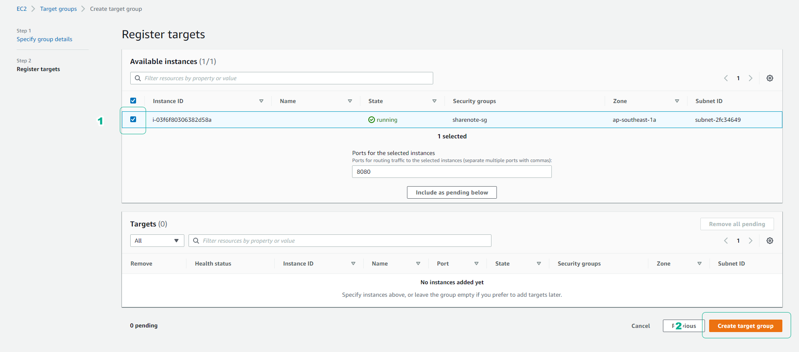

# aws-asg-alb-targetgroup-demo 🐳


[](https://github.com/tquangdo/aws-asg-alb-targetgroup-demo/issues/new)


---


## reference
[awsstudygroup](https://000006.awsstudygroup.com/vi/)

## rds
- instance name=`DTQDBInstance_ASGDemo`
- db name=`DTQNoteDB`


## ec2
- `DTQEC2Ubuntu_ASGDemo`

- create & run `startup.sh`
```shell
sudo vi /etc/init.d/startup.sh
sudo chmod +x /etc/init.d/startup.sh
. /etc/init.d/startup.sh
```
- create crontab
```shell
crontab -e
-> input `2` & add src code in `vim.basic`
```

## ami
- `DTQ_AMI_ASGDemo`


## launch template
- `DTQLaunchTemp_ASGDemo`


## target group
- `DTQTargetGrp_ASGDemo`


## ALB
- `DTQ_ALB_ASGDemo`


## ASG
- `DTQ_ASG_ASGDemo`

---

---

